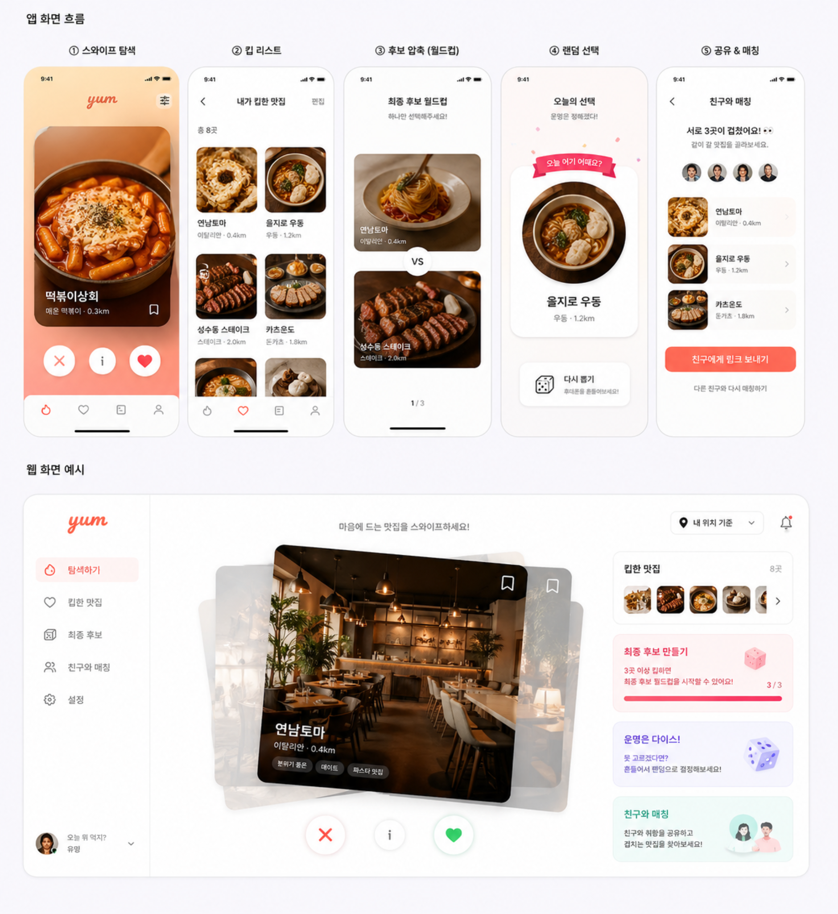

# 🍽️ Yum

> 사진으로 스와이프하고, 친구와 매칭으로 결정하는 **감성 맛집 앱**.
> 1인 토이 프로젝트 · 수익화 X · "내가 쓰고 싶어서 만든 가장 예쁜 맛집 앱"이 목표.



---

## 🚦 현재 상태

- ✅ **MVP 1차 완료** — 위치 동의 → API 호출 → 카드 스와이프
- ✅ **실데이터 연동** — 카카오 로컬(식당 텍스트) + 네이버 이미지(사진), Adapter 패턴
- ✅ **Vercel 배포 + GitHub 연동** — push만 하면 자동 빌드·배포
- ✅ **Mock fallback** — 외부 API 실패·키 누락 시 자동으로 장난스러운 mock + 노란 배너로 알림

자세한 결정은 [`docs/decisions/`](./docs/decisions) (ADR 1~10), 코드 컨벤션은 [`docs/conventions/`](./docs/conventions) 참고.

---

## 🗺️ 로드맵

### 🔧 우선 개선 (다음 작업 — 우선순위 ↑)

- [ ] **거리 100m 단위 표시** — 현재 200m 차이도 "0km" 으로 보임. `0.2km`로 정확히 (Math.round 단계 수정)
- [ ] **카테고리 필터** — 화면에서 카테고리 칩으로 검색 토글
  - 한식 / 중식 / 일식 / 양식 / 분식 / 패스트푸드
  - "아무거나" (하단)
  - **전체 해제** 기능
  - 카카오 카테고리 그룹 코드(`FD6`) 안에서 세부 카테고리로 필터링

### 🎯 추가 기능 (To-do)

- [ ] **웹용 화면(데스크탑/태블릿)** — 현재 모바일 우선. 사이드바 + 카드 스택 레이아웃 (프로토타입 하단 디자인 참고)
- [ ] **킵 리스트** — ❤️ 한 식당 모아보기 (place_id만 저장 권장 — 저작권 회색 회피)
- [ ] **최종 후보 월드컵** — 킵 3~5개 모이면 토너먼트로 1픽
- [ ] **랜덤 선택** — 킵 중 무작위 1곳 (Shake 또는 버튼)
- [ ] **친구와 매칭** — 후보 링크 공유 → 둘 다 ❤️한 식당 자동 매치 (바이럴 포인트)
- [ ] **앱으로 만들기** — 완전 나중. PWA 또는 React Native/Capacitor 검토

### 🩹 기타 개선 (잡 백로그)

- [ ] 페이지네이션 — 10개 다 본 후 "더 보기" (카카오 `page` 파라미터)
- [ ] 카카오 응답 `distanceKm` 0으로 떨어지는 케이스 검증 (반올림 로직)
- [ ] 햅틱·스켈레톤·Undo 등 기획안의 디테일

---

## 🏗️ 기술 스택

| 영역 | 선택 | ADR |
| --- | --- | --- |
| 프론트엔드 | **Svelte 5 + Vite + TypeScript** | [0001](./docs/decisions/0001-frontend-framework.md), [0004](./docs/decisions/0004-typescript.md) |
| 스타일링 | 순수 CSS + `<style>` 블록 + **BEM** | [0002](./docs/decisions/0002-styling.md) |
| 카드 스와이프 | `svelte-gestures` 5.x + Svelte spring/tweened | [0003](./docs/decisions/0003-card-swipe-gesture.md) |
| 디렉토리 | 모노레포 `frontend/` + `backend/` | [0005](./docs/decisions/0005-monorepo-structure.md) |
| Mock API | Vite middleware (dev) + Vercel function (prod) — 같은 모듈 공유 | [0006](./docs/decisions/0006-mock-api-strategy.md) |
| Lint/Format | ESLint 10 + Prettier 3 | [0007](./docs/decisions/0007-lint-format.md) |
| 배포 | **Vercel + GitHub** + Serverless Function | [0008](./docs/decisions/0008-vercel-deployment.md) |
| 외부 API | 카카오 로컬 + 네이버 이미지, **Adapter 패턴** | [0009](./docs/decisions/0009-external-api-adapter.md) |
| 백엔드 스택 | **Node.js (TS) on Vercel** | [0010](./docs/decisions/0010-backend-stack.md) |

---

## 🚀 로컬 실행

```bash
cd frontend
npm install
cp .env.example .env.local   # 카카오·네이버 키를 .env.local에 채우기 (없으면 mock 동작)
npm run dev
```

→ http://localhost:5173

키 발급:
- 카카오 REST API: https://developers.kakao.com (제품 설정 → 카카오맵 활성화 필수)
- 네이버 검색 API: https://developers.naver.com (사용 API "검색" 체크)

배포 가이드: [`docs/conventions/deployment.md`](./docs/conventions/deployment.md)

---

## 📂 프로젝트 구조

```
yum/
├── README.md                ← 이 파일
├── CLAUDE.md                ← Claude 작업 규칙 (R1~R8)
├── prototype.png            ← UI 프로토타입
├── docs/                    ← 의사결정·컨벤션·리서치
│   ├── decisions/           ← ADR 0001~0010
│   ├── conventions/         ← clean-architecture, BEM, lint-format, deployment
│   └── research/            ← API 가격, 백엔드 스택 비교
├── frontend/                ← Svelte 5 + Vite + TS
│   ├── api/                 ← Vercel Serverless Functions
│   │   ├── restaurants.ts   ← /api/restaurants 핸들러
│   │   ├── _data.ts         ← Mock fallback (장난스러운 데이터)
│   │   └── _providers/      ← Adapter (Kakao/Naver/Mock)
│   └── src/
│       └── lib/
│           ├── domain/      ← 순수 타입·규칙
│           ├── application/ ← 화면 상태머신
│           ├── infrastructure/ ← API 클라이언트
│           ├── ui/          ← Svelte 컴포넌트
│           └── styles/      ← global.css (디자인 토큰)
└── backend/                 ← (다음 단계) Go 또는 Node 서버
```

---

## 🤝 작업 원칙

이 프로젝트의 모든 결정·규칙은 [`CLAUDE.md`](./CLAUDE.md) 와 [`docs/`](./docs) 에 기록되어 있습니다.
- 의사결정 → ADR (`docs/decisions/`)
- 코드 컨벤션 → `docs/conventions/`
- 외부 조사 자료 → `docs/research/`
- 운영·디버깅 함정 → `CLAUDE.md` D1~D6
